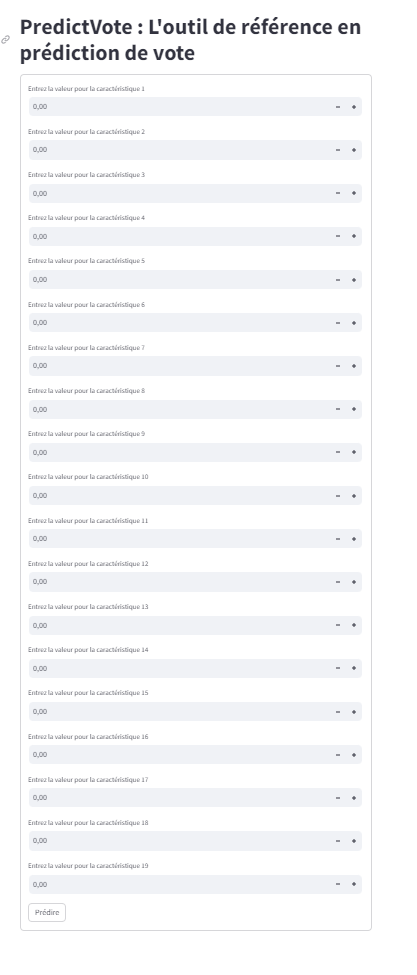

# PredictVote Project

## Overview

PredictVote is a predictive analytics project focused on leveraging French public datasets to forecast voting patterns in municipal elections. By harnessing data from the French National Institute of Statistics and Economic Studies (INSEE) and other websites, PredictVote aims to create a robust dataset that encompasses various municipal features and voting trends from 2017 to 2021.

## Features of the Dataset

Each municipality in the dataset is characterized by the following attributes:

- **code_dep**: Department code.
- **lib_commune**: Commune name.
- **Inscrits**: Number of registered voters.
- **Votants**: Number of actual voters.
- **Nom**: Names of candidates or significant entities.
- **% Voix/Exp**: Percentage of votes.
- **year**: Year of data collection.
- **code_commune_INSEE**: Communal INSEE code.
- **code_postal**: Postal code.
- **latitude**: Geographical latitude.
- **longitude**: Geographical longitude.
- **victimes_par_hab**: Victims per inhabitant.
- **infractions_par_hab**: Infractions per inhabitant.
- **mosquee_par_hab**: Mosques per inhabitant.
- **NB_Pers_par_Foyer_Alloc_par_hab**: Number of allowance-receiving individuals per household.
- **statut_commune_uu2020**: Commune status in 2020.
- **revenu_imposable_par_habitant**: Taxable income per inhabitant.
- **rural**: Rural status indicator.
- **montagne**: Mountainous area indicator.
- **touristique**: Tourism area indicator.
- **ptot_n**: Total population.
- **dep_inv_hor_remb_par_hab**: Non-reimbursed investment expenditure per inhabitant.
- **dot_glo_fonc_par_hab**: Global functional endowment per inhabitant.
- **conso_ind_par_hab**: Industrial consumption per inhabitant.
- **cons_agr_par_hab**: Agricultural consumption per inhabitant.
- **conso_ter_par_hab**: Tertiary sector consumption per inhabitant.
- **conso_res_par_hab**: Residential consumption per inhabitant.

## Project Workflow

### Step 1: Data Aggregation
Compile and clean datasets from various sources to create a unified and comprehensive dataset ready for analysis.

### Step 2: Model Development and Testing
Evaluate various machine learning models to identify the most accurate predictor based on predefined performance metrics.

## Accessing the Dataset

The dataset can be accessed and downloaded through the following link:
[Download Dataset](https://drive.google.com/drive/folders/1bSHFMVzuUL2KWNdyiowYFEcjuPng7V04?usp=sharing).

In the drive, you can find PROOFCONCEPT.zip with all the data and the merging methods

## Project Objectives

Our primary goal is to predict voting outcomes for French EU representatives by analyzing municipal features. This model aims to provide insights ahead of the upcoming EU elections, helping to identify political inclinations across different towns.

## Significance of the Project

As EU elections approach, understanding the potential voting trends at the municipal level is crucial. This project offers valuable predictions that can assist political analysts, campaign managers, and policymakers in strategic decision-making based on localized data.

1. [Communal Accounts from 2014 to 2021](https://www.data.gouv.fr/fr/datasets/comptes-des-communes-2014-2021/) - Financial data for French communes over several years.
2. [Mosques in La Salat](https://www.la-salat.com/mosquees) - Directory of mosques found in the La Salat region.
3. [2017 French Presidential Election Results](https://www.data.gouv.fr/fr/datasets/election-presidentielle-des-23-avril-et-7-mai-2017-resultats-definitifs-du-1er-tour-par-communes/) - Official results of the first round of the 2017 French presidential election by commune.
4. [2022 French Presidential Election Results](https://www.data.gouv.fr/fr/datasets/election-presidentielle-des-10-et-24-avril-2022-resultats-definitifs-du-2nd-tour/) - Final results of the second round of the 2022 French presidential election.
5. [Annual Electricity and Gas Consumption by NAF Codes](https://opendata.agenceore.fr/explore/dataset/conso-elec-gaz-annuelle-par-naf-agregee-commune/information/) - Aggregated annual energy usage data by NAF economic classification at the commune level.

## How to Test the Model?
### You Can Use Our Streamlit App


```bash
python -m streamlit run streamlit/app.py
